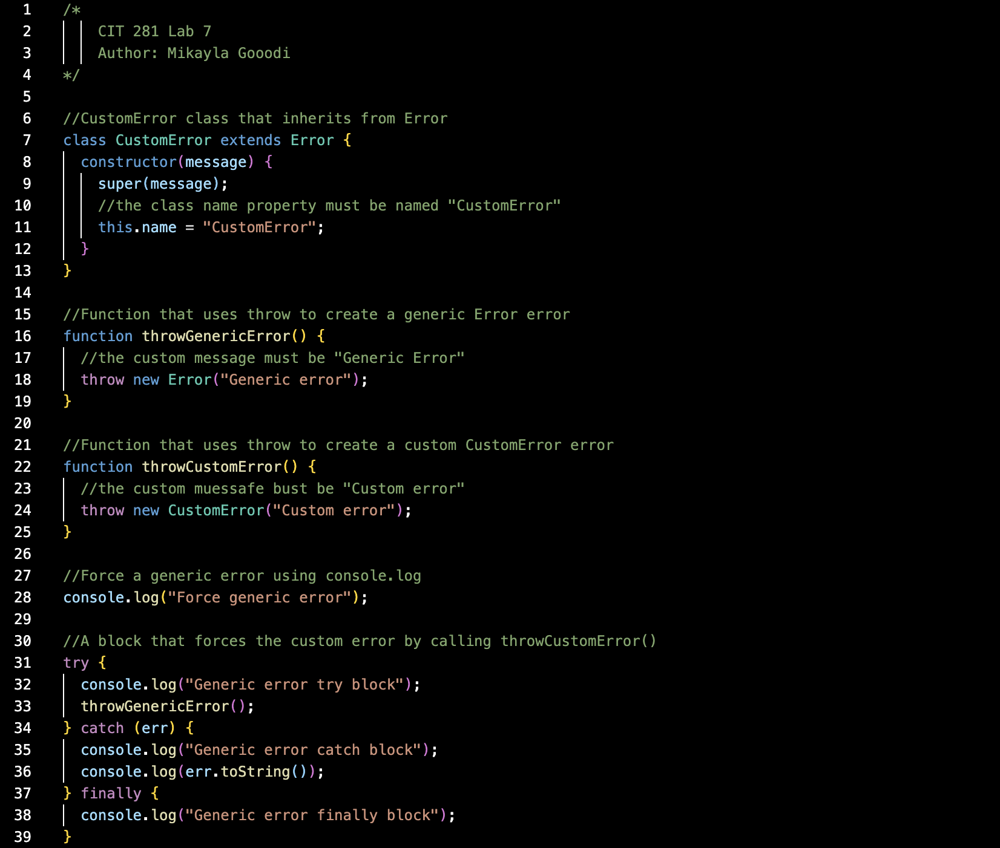

# Lab 7 - GitHub Organizations & Repo Structure

## Purpose
This lab focused on creating and configuring a GitHub Organization. It introduced collaborative workflows, team repo structures, and role-based access, preparing us for larger projects using shared repositories. 

## Technologies Used 
- GitHub Organizations
- GitHub Teams
- Repository Roles & Permissions

## What I Learned 
- How to create and configure GitHub organizations
- How to manage team-level repo accoess
- How to set up repositories for structured collaboration

